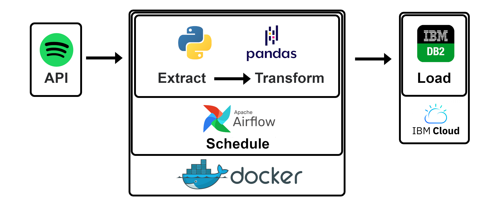

# Spotify ETL Pipeline

The goal of this project is to design and build a data ETL pipeline, extracting and transforming data from the Spotify 
API and loading it into a data warehouse hosted on IBM Cloud. The whole process will be automated using Apache Airflow.

Data that will be extracted are songs played, artists and the timestamp. With this data, there can be built some charts 
about the listening behaviour of the tracked user. This data analysis part is not yet included in the project but might 
be added later on.
<br></br>
> **Disclaimer**: This is meant as a personal learning project. This project could be set up by just scheduling a simple
> python file with crontab and loading the data into an SQLite-Database. But where is the fun in that? I wanted to include
> as many technologies as possible and deepen my knowledge of them.

<br></br>
The following picture illustrates the pipeline's components and the flow of data.



# Prerequisites
Log in with the account to track and get a token from [https://developer.spotify.com/console/get-recently-played/](https://developer.spotify.com/console/get-recently-played/). 
Set a checkmark at the option <b>user-read-recently-played</b>.

# Create an IBM DB2 database instance on IBM Cloud
Design and create <b>IBM DB2</b> database on <b>IBM Cloud</b>. It might be useful to create a star schema data warehouse 
and split the data across multiple tables. But for simplicity, we will create one table to hold all data. The table
can be created with the following statement:

```sql
CREATE TABLE song_data (
    song VARCHAR(30),
    artist VARCHAR(30), 
    time_stamp VARCHAR(19)
)
```
Furthermore, create a new <b>service credential</b> to be able to connect to the database via Python later on. 

# Create the ETL functions
All the functionalities for the ETL process of the pipeline will be contained in a python file. These functions include:
- Receive data from the Spotify API. This will return a JSON-File with all kinds of data.
- Filter only the wanted data (song names, artist names and timestamp) from the JSON-File and convert them into a pandas 
  dataframe.
- Validate the integrity of the data. This will check for example for NULL Values and make sure all 
  timestamps are from 24h before.
- Connect to the IBM BD2 Instance on the IBM Cloud and insert the new data into the table in the database.

The python file can be found [here](dags/spotify_pipeline/spotify_pipeline_functions.py) in this repository.

# Create a DAG for Airflow
Next, create an Airflow DAG to import and run the python file.

```python
from airflow import DAG
from airflow.operators.python import PythonOperator
from pendulum import datetime
from spotify_pipeline.spotify_pipeline_functions import spotify_pipeline

with DAG(
    "spotify_pipeline_dag",
    start_date=datetime(year=2022, month=7, day=7, tz="UTC"),
    schedule_interval="@daily"
) as dag:
    op = PythonOperator(
        task_id="spotify_pipeline",
        python_callable=spotify_pipeline
    )

    op
```

# Run Airflow server with Docker Compose 
The last step is to run the Airflow server. I used a docker container on a local Windows machine to test the functionality.
A guide on how to set up Docker Compose to run Airflow can be found on the [Airflow Docs](https://airflow.apache.org/docs/apache-airflow/stable/start/docker.html).
I then set up an Airflow server on a remote Linux server (Ubuntu 20.04.4).
